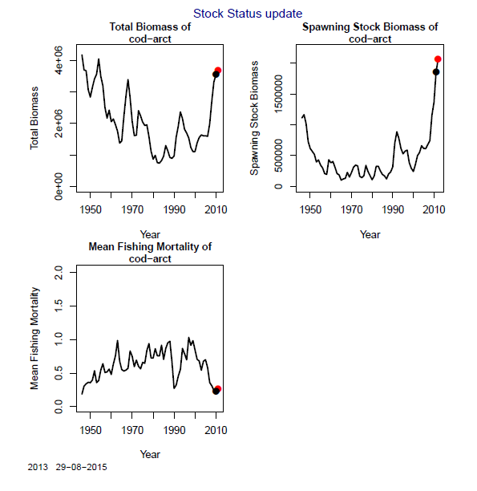

#Stock Assessment Graph creator"
## "StockG"
***
###Function Aim: Creates graphs for fish stock assessment data  on Total biomass, Spawning stock Biomass and Fishing mortality, including where available the Bmsy, SSBlim and Fmsy.
***



* StockG = The Stock Assessment Graph Generator
* Interface 1.r = Is the code to use WITHOUT target or limit lines (Bmsy, SSBlim & Fmsy)(correlated data is fishdata.csv)
* Interface 2.r = Is the code to use WITH the target or limit lines (correlated data is fishdata_Bmsy.csv)
* fishdata.csv = example ICES fish stock assessment data
* Stock_plot1.pdf = example of what interface 1 produces
* Stock_plot2.pdf = example of what interface 2 produces

***

##DATA
####Example data 
```{r}
fish<-read.csv("fishdata.csv",header=T)
#You can change the name of the excel file but keep it csv
```

####Download data from ICES Stock assessment database or alternative stock assessment data provider i.e. NOAA
Citition: "ICES Stock Database , 2012, 12. ICES, Copenhagen."

<http://standardgraphs.ices.dk/stockList.aspx>

  * "fishdata.csv" is 17 fisheries data merged together
  * Cut columns that are not necessary ... 
  * Rename column names to match input names
  * Load excel file saved as csv file with correct associated headers of FishStock (Fishstock name), TBiomas(Total Biomass), SSB (Spawning Stock Biomass),MeanF( mean fish mortality), including where available the Bmsy, SSBlim and Fmsy which should be in a column.

####Example header of the csv information format
```{r}
# FishStock  AssessmentYear Year  TBiomass     SSB    MeanF    Bmsy SSBlim Fmsy
#  cod-arct     2012        1946  4168882   1112776    0.1857 2568700 220000  0.4
#  cod-arct     2012        1947  3692801   1165059    0.3047 2568700 220000  0.4
#  cod-arct     2012        1948  3665819   1019114    0.3398 2568700 220000  0.4
#  cod-arct     2012        1949  3065111    729879    0.3619 2568700 220000  0.4
# cod-arct      2012       1950  2830103    615339    0.3566 2568700 220000  0.4
# cod-arct      2012       1951  3141009    568705    0.3966 2568700 220000  0.4
```


##Stock Assessment Graph Generator
The data you load should look like above. 
```{r}
head(fish)
```

Check the column header and attach 
```{r}
names(fish)   
attach(fish) 
dev.off()  #just in case you have left anything 
```

####Name the pdf output
```{r}
pdf('Stock_plot.pdf')
```

####Load fish stock graph generator
```{r}
source("StockG.r") 
```

Change the column header names only if different from these listed (KEEP IN SAME ORDER)
```{r}
exceltitle<-rbind(as.character(FishStock),AssessmentYear,Year,TBiomass,SSB,MeanF,Bmsy,SSBlim,Fmsy)  
```

####Number of stock/fishery  being generated 
Change the number of stock dependant on the number of stock you want to make graphs of. If you don't know copy and paste 'unique(FishStock)'.

```{r}
NF<-17 #(This means there is 17 fish stocks in use from the fishdata.csv loaded)
```

####Run the function and open up you folder to time a pdf with the stock assessment graphs
```{r}
#FISHSTOCK(NF,exceltitle) 
```

***
[Checkout the PDF example ](https://github.com/adaish/StockG/blob/master/Stock_plot2.pdf)

***
(Next step is to make these ggplot2 graphs with shiny dropdown for the data)


